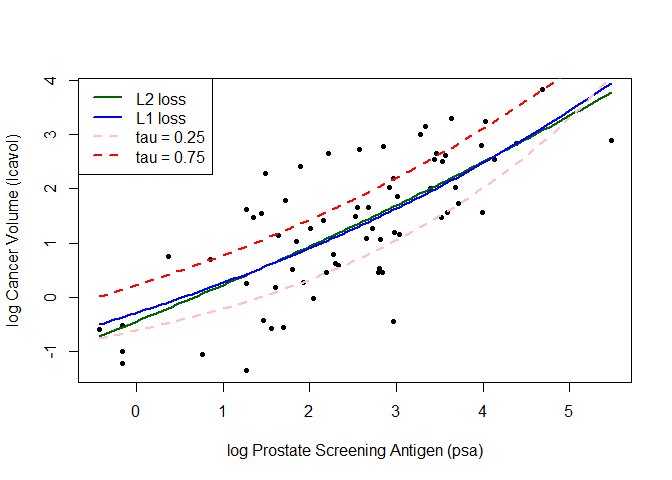

Homework_2
================
Yuhao Zhang
2024-01-26

# Code in class

``` r
## load prostate data
prostate <- read.csv("prostate.csv")

## subset to training examples
prostate_train <- subset(prostate, train==TRUE)

## plot lcavol vs lpsa
plot_psa_data <- function(dat=prostate_train) {
  plot(dat$lpsa, dat$lcavol,
       xlab="log Prostate Screening Antigen (psa)",
       ylab="log Cancer Volume (lcavol)",
       pch = 20)
}
plot_psa_data()

############################
## regular linear regression
############################

## L2 loss function
L2_loss <- function(y, yhat)
  (y-yhat)^2

## fit simple linear model using numerical optimization
## ... - arguments passed to los
fit_lin <- function(y, x, loss=L2_loss, beta_init = c(-0.51, 0.75), ...) {
  
  ## function to compute training error
  err <- function(beta)
    mean(loss(y,  beta[1] + beta[2]*x, ...))
  
  ## find value of beta that minimizes training error
  beta <- optim(par = beta_init, fn = err)
  
  
  return(beta)
}

## make predictions from linear model
predict_lin <- function(x, beta)
  beta[1] + beta[2]*x

## fit linear model
lin_beta <- fit_lin(y=prostate_train$lcavol,
                    x=prostate_train$lpsa,
                    loss=L2_loss)

## compute predictions for a grid of inputs
x_grid <- seq(min(prostate_train$lpsa),
              max(prostate_train$lpsa),
              length.out=100)
lin_pred <- predict_lin(x=x_grid, beta=lin_beta$par)

## plot data
plot_psa_data()

## plot predictions
lines(x=x_grid, y=lin_pred, col='darkgreen', lwd=2)

## do the same thing with 'lm'
lin_fit_lm <- lm(lcavol ~ lpsa, data=prostate_train)

## make predictins using 'lm' object
lin_pred_lm <- predict(lin_fit_lm, data.frame(lpsa=x_grid))

## plot predictions from 'lm'
lines(x=x_grid, y=lin_pred_lm, col='pink', lty=2, lwd=2)
```

<!-- -->

# Code for L1 loss function

``` r
##################################
## try modifying the loss function
##################################

## L1 loss function
L1_loss <- function(y, yhat)
  abs(y-yhat)

## fit simple linear model using numerical optimization
## ... - arguments passed to los
fit_lin_2 <- function(y, x, loss=L1_loss, beta_init = c(-0.51, 0.75), ...) {
  
  ## function to compute training error
  err <- function(beta)
    mean(loss(y,  beta[1] + beta[2]*x, ...))
  
  ## find value of beta that minimizes training error
  beta <- optim(par = beta_init, fn = err)
  
  
  return(beta)
}

## make predictions from linear model
predict_lin <- function(x, beta)
  beta[1] + beta[2]*x

## fit linear model
lin_beta <- fit_lin(y=prostate_train$lcavol,
                    x=prostate_train$lpsa,
                    loss=L1_loss)

## compute predictions for a grid of inputs
x_grid <- seq(min(prostate_train$lpsa),
              max(prostate_train$lpsa),
              length.out=100)
lin_pred_2 <- predict_lin(x=x_grid, beta=lin_beta$par)

## plot data
plot_psa_data()

## plot predictions
lines(x=x_grid, y=lin_pred_2, col='darkgreen', lwd=2)
```

<!-- -->

# Code for tilted absolute loss function

``` r
##################################
## try modifying the loss function
##################################

## tilted absolute loss
tilted_abs_loss <- function(y, yhat, tau) {
  
  d <- y-yhat
  
  ifelse(d > 0, d * tau, d * (tau - 1))
}

custom_loss <- tilted_abs_loss

## plot custom loss function
err_grd <- seq(-1,1,length.out=200)
plot(err_grd, custom_loss(0, err_grd, tau=0.50), type='l',
     xlab='y-yhat', ylab='custom loss')
```

<!-- -->

``` r
## fit linear model with custom loss
lin_beta_custom <- fit_lin(y=prostate_train$lcavol,
                           x=prostate_train$lpsa,
                           loss=custom_loss,
                           tau=0.25)

## fit linear model with custom loss
lin_beta_custom_2 <- fit_lin(y=prostate_train$lcavol,
                           x=prostate_train$lpsa,
                           loss=custom_loss,
                           tau=0.75)

lin_pred_custom <- predict_lin(x=x_grid, beta=lin_beta_custom$par)
lin_pred_custom_2 <- predict_lin(x=x_grid, beta=lin_beta_custom_2$par)

## plot data
plot_psa_data()

## plot predictions from L2 loss
lines(x=x_grid, y=lin_pred, col='darkgreen', lwd=2)

## plot predictions from L1 loss
lines(x=x_grid, y=lin_pred_2, col='blue', lwd=2)

## plot predictions from custom loss
lines(x=x_grid, y=lin_pred_custom, col='pink', lwd=2, lty=2)

## plot predictions from custom loss
lines(x=x_grid, y=lin_pred_custom_2, col='red', lwd=2, lty=2)

legend("topleft", legend=c('L2 loss','L1 loss','tau = 0.25','tau = 0.75'), 
       col=c('darkgreen','blue','pink','red'),
       lty=c(1, 1, 2, 2),
       lwd=c(2, 2, 2, 2))
```

<!-- -->

# A simple nonlinear model with three parameters

``` r
## fit simple linear model using numerical optimization
## ... - arguments passed to los
fit_lin <- function(y, x, loss, beta_init = c(-1.0, 0.0, -0.3), ...) {
  
  ## function to compute training error
  err <- function(beta)
    mean(loss(y,  beta[1] + beta[2]*exp(-beta[3]*x), ...))
  
  ## find value of beta that minimizes training error
  beta <- optim(par = beta_init, fn = err)
  
  
  return(beta)
}

## make predictions from linear model
predict_lin <- function(x, beta)
  beta[1] + beta[2]*exp(-beta[3]*x)

## fit linear model
lin_beta <- fit_lin(y=prostate_train$lcavol,
                    x=prostate_train$lpsa,
                    loss=L2_loss)

## compute predictions for a grid of inputs
x_grid <- seq(min(prostate_train$lpsa),
              max(prostate_train$lpsa),
              length.out=100)
lin_pred <- predict_lin(x=x_grid, beta=lin_beta$par)

## fit linear model
lin_beta <- fit_lin(y=prostate_train$lcavol,
                    x=prostate_train$lpsa,
                    loss=L1_loss)

## compute predictions for a grid of inputs
lin_pred_2 <- predict_lin(x=x_grid, beta=lin_beta$par)

## fit linear model with custom loss
lin_beta_custom <- fit_lin(y=prostate_train$lcavol,
                           x=prostate_train$lpsa,
                           loss=custom_loss,
                           tau=0.25)

## fit linear model with custom loss
lin_beta_custom_2 <- fit_lin(y=prostate_train$lcavol,
                           x=prostate_train$lpsa,
                           loss=custom_loss,
                           tau=0.75)

lin_pred_custom <- predict_lin(x=x_grid, beta=lin_beta_custom$par)
lin_pred_custom_2 <- predict_lin(x=x_grid, beta=lin_beta_custom_2$par)

## plot data
plot_psa_data()

## plot predictions from L2 loss
lines(x=x_grid, y=lin_pred, col='darkgreen', lwd=2)

## plot predictions from L1 loss
lines(x=x_grid, y=lin_pred_2, col='blue', lwd=2)

## plot predictions from custom loss
lines(x=x_grid, y=lin_pred_custom, col='pink', lwd=2, lty=2)

## plot predictions from custom loss
lines(x=x_grid, y=lin_pred_custom_2, col='red', lwd=2, lty=2)

legend("topleft", legend=c('L2 loss','L1 loss','tau = 0.25','tau = 0.75'), 
       col=c('darkgreen','blue','pink','red'),
       lty=c(1, 1, 2, 2),
       lwd=c(2, 2, 2, 2))
```

<!-- -->
