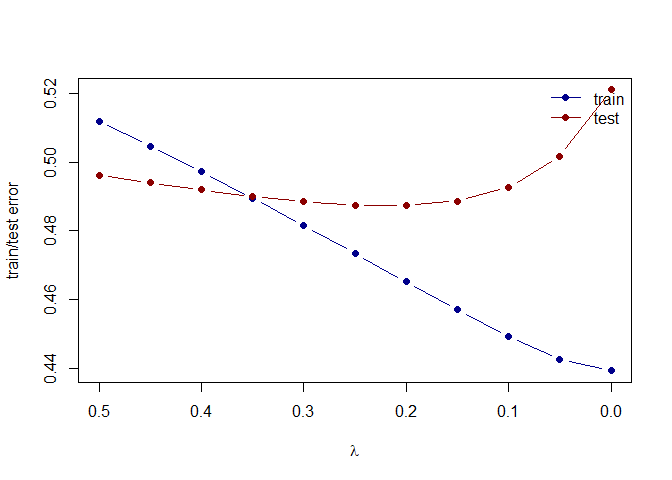
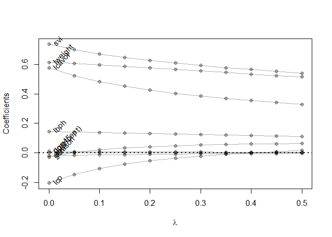

Homework 3
================
Yuhao Zhang
2024-02-15

# Load all required packages.

``` r
library('splines')        ## for 'bs'
library('dplyr')          ## for 'select', 'filter', and others
```

    ## Warning: 程辑包'dplyr'是用R版本4.2.3 来建造的

    ## 
    ## 载入程辑包：'dplyr'

    ## The following objects are masked from 'package:stats':
    ## 
    ##     filter, lag

    ## The following objects are masked from 'package:base':
    ## 
    ##     intersect, setdiff, setequal, union

``` r
library('magrittr')       ## for '%<>%' operator
```

    ## Warning: 程辑包'magrittr'是用R版本4.2.3 来建造的

``` r
library('glmnet')         ## for 'glmnet'
```

    ## Warning: 程辑包'glmnet'是用R版本4.2.3 来建造的

    ## 载入需要的程辑包：Matrix

    ## Loaded glmnet 4.1-8

# Use the prostate cancer data.

``` r
## load prostate data
prostate <- 
  read.table(url(
    'https://web.stanford.edu/~hastie/ElemStatLearn/datasets/prostate.data'))

prostate_train <- prostate %>%
  filter(train == TRUE) %>% 
  select(-train)

prostate_test <- prostate %>%
  filter(train == FALSE) %>% 
  select(-train)
```

# With the training subset of the prostate data, train a least-squares regression model with all predictors. Treat lpsa as the outcome, and use all other variables in the data set as predictors. And Using the testing subset to compute the test error (average squared-error loss) using the fitted least-squares regression model.

``` r
## predict lpsa consider all other predictors
## lm fits using L2 loss
fit <- lm(lpsa ~ ., data=prostate_train)

## functions to compute testing/training error w/lm
L2_loss <- function(y, yhat)
  (y-yhat)^2
error <- function(dat, fit, loss=L2_loss)
  mean(loss(dat$lpsa, predict(fit, newdata=dat)))

## train_error 
error(prostate_train, fit)
```

    ## [1] 0.4391998

``` r
## testing error
error(prostate_test, fit)
```

    ## [1] 0.521274

# Train a ridge regression model (see glmnet in R or sklearn.linear_model and its alpha argument in Python) and tune the value of lambda, i.e., for a sequence of lambda find the value of lambda that approximately minimizes the test error. And, Creating a figure that shows the training and test error associated with ridge regression as a function of lambda.

``` r
## use glmnet to fit ridge
## glmnet fits using penalized L2 loss
## first create an input matrix and output vector
form  <- lpsa ~  lcavol + lweight + age + lbph + lcp + pgg45 + svi + gleason
x_inp <- model.matrix(form, data=prostate_train)
y_out <- prostate_train$lpsa
fit <- glmnet(x=x_inp, y=y_out, alpha = 0, lambda=seq(0.5, 0, -0.05))
print(fit$beta)
```

    ## 9 x 11 sparse Matrix of class "dgCMatrix"

    ##    [[ suppressing 11 column names 's0', 's1', 's2' ... ]]

    ##                                                                              
    ## (Intercept)  .            .            .             .            .          
    ## lcavol       0.330033285  0.341589837  0.3544771780  0.368972918  0.385350033
    ## lweight      0.515702133  0.525401042  0.5354348208  0.545774936  0.556333416
    ## age         -0.004889214 -0.005636617 -0.0064641968 -0.007389019 -0.008433635
    ## lbph         0.111247895  0.113960541  0.1167938799  0.119761396  0.122899867
    ## lcp          0.015113718  0.008036700 -0.0002374648 -0.010099378 -0.022038917
    ## pgg45        0.004390006  0.004514712  0.0046621277  0.004839771  0.005060079
    ## svi          0.541703554  0.553405591  0.5658135655  0.579176717  0.593901939
    ## gleason      0.063402681  0.061363090  0.0588887163  0.055895060  0.052234345
    ##                                                                             
    ## (Intercept)  .            .            .            .            .          
    ## lcavol       0.404130918  0.426074441  0.452123247  0.483787288  0.523682897
    ## lweight      0.567063929  0.577889623  0.588568720  0.598709576  0.607672220
    ## age         -0.009618197 -0.010967693 -0.012522584 -0.014334831 -0.016464993
    ## lbph         0.126206606  0.129663881  0.133291299  0.137089205  0.140983846
    ## lcp         -0.036651184 -0.054804333 -0.077864474 -0.107951309 -0.148533504
    ## pgg45        0.005338760  0.005700404  0.006186666  0.006865954  0.007867088
    ## svi          0.610203738  0.628338820  0.649022507  0.673210509  0.701932250
    ## gleason      0.047604314  0.041500842  0.033144271  0.021129661  0.002465277
    ##                         
    ## (Intercept)  .          
    ## lcavol       0.576361989
    ## lweight      0.614010456
    ## age         -0.019004296
    ## lbph         0.144877454
    ## lcp         -0.206098858
    ## pgg45        0.009452544
    ## svi          0.737221825
    ## gleason     -0.029176315

``` r
## functions to compute testing/training error with glmnet
error <- function(dat, fit, lam, form, loss=L2_loss) {
  x_inp <- model.matrix(form, data=dat)
  y_out <- dat$lpsa
  y_hat <- predict(fit, newx=x_inp, s=lam)  ## see predict.elnet
  mean(loss(y_out, y_hat))
}

## train_error at lambda=0
error(prostate_train, fit, lam=0, form=form)
```

    ## [1] 0.4391998

``` r
## testing error at lambda=0
error(prostate_test, fit, lam=0, form=form)
```

    ## [1] 0.5211267

``` r
## train_error at lambda=0.03
error(prostate_train, fit, lam=0.05, form=form)
```

    ## [1] 0.4424561

``` r
## testing error at lambda=0.03
error(prostate_test, fit, lam=0.05, form=form)
```

    ## [1] 0.5017593

``` r
## compute training and testing errors as function of lambda
err_train_1 <- sapply(fit$lambda, function(lam) 
  error(prostate_train, fit, lam, form))
err_test_1 <- sapply(fit$lambda, function(lam) 
  error(prostate_test, fit, lam, form))

## plot test/train error
plot(x=range(fit$lambda),
     y=range(c(err_train_1, err_test_1)),
     xlim=rev(range(fit$lambda)),
     type='n',
     xlab=expression(lambda),
     ylab='train/test error')
points(fit$lambda, err_train_1, pch=19, type='b', col='darkblue')
points(fit$lambda, err_test_1, pch=19, type='b', col='darkred')
legend('topright', c('train','test'), lty=1, pch=19,
       col=c('darkblue','darkred'), bty='n')
```

<!-- -->

``` r
colnames(fit$beta) <- paste('lam =', fit$lambda)
print(fit$beta %>% as.matrix)
```

    ##                lam = 0.5   lam = 0.45     lam = 0.4   lam = 0.35    lam = 0.3
    ## (Intercept)  0.000000000  0.000000000  0.0000000000  0.000000000  0.000000000
    ## lcavol       0.330033285  0.341589837  0.3544771780  0.368972918  0.385350033
    ## lweight      0.515702133  0.525401042  0.5354348208  0.545774936  0.556333416
    ## age         -0.004889214 -0.005636617 -0.0064641968 -0.007389019 -0.008433635
    ## lbph         0.111247895  0.113960541  0.1167938799  0.119761396  0.122899867
    ## lcp          0.015113718  0.008036700 -0.0002374648 -0.010099378 -0.022038917
    ## pgg45        0.004390006  0.004514712  0.0046621277  0.004839771  0.005060079
    ## svi          0.541703554  0.553405591  0.5658135655  0.579176717  0.593901939
    ## gleason      0.063402681  0.061363090  0.0588887163  0.055895060  0.052234345
    ##               lam = 0.25    lam = 0.2   lam = 0.15    lam = 0.1   lam = 0.05
    ## (Intercept)  0.000000000  0.000000000  0.000000000  0.000000000  0.000000000
    ## lcavol       0.404130918  0.426074441  0.452123247  0.483787288  0.523682897
    ## lweight      0.567063929  0.577889623  0.588568720  0.598709576  0.607672220
    ## age         -0.009618197 -0.010967693 -0.012522584 -0.014334831 -0.016464993
    ## lbph         0.126206606  0.129663881  0.133291299  0.137089205  0.140983846
    ## lcp         -0.036651184 -0.054804333 -0.077864474 -0.107951309 -0.148533504
    ## pgg45        0.005338760  0.005700404  0.006186666  0.006865954  0.007867088
    ## svi          0.610203738  0.628338820  0.649022507  0.673210509  0.701932250
    ## gleason      0.047604314  0.041500842  0.033144271  0.021129661  0.002465277
    ##                  lam = 0
    ## (Intercept)  0.000000000
    ## lcavol       0.576361989
    ## lweight      0.614010456
    ## age         -0.019004296
    ## lbph         0.144877454
    ## lcp         -0.206098858
    ## pgg45        0.009452544
    ## svi          0.737221825
    ## gleason     -0.029176315

# Create a path diagram of the ridge regression analysis, similar to HTF Figure 3.8

``` r
## plot path diagram
plot(x=range(fit$lambda),
     y=range(as.matrix(fit$beta)),
     type='n',
     xlab=expression(lambda),
     ylab='Coefficients')
for(i in 1:nrow(fit$beta)) {
  points(x=fit$lambda, y=fit$beta[i,], pch=19, col='#00000055')
  lines(x=fit$lambda, y=fit$beta[i,], col='#00000055')
}
text(x=0, y=fit$beta[,ncol(fit$beta)], 
     labels=rownames(fit$beta),
     xpd=NA, pos=4, srt=45)
abline(h=0, lty=3, lwd=2)
```

<!-- -->
